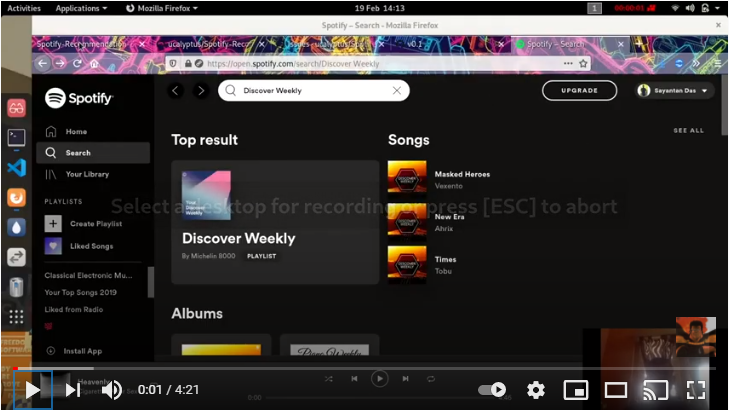

<h1 align="center">Spotify Recommendation Engine</h1>
<p align="center">
 
</p>

## About the Project:
#### Check my video to understand this project better.

[](https://www.youtube.com/watch?v=otrW8brCAiU)

## Requirements
* spotipy
```bash
 pip install spotipy
```
[Spotify Developer](https://beta.developer.spotify.com/documentation/web-api/) for more info 

## Recommender System:
## [Notebook](https://github.com/ucalyptus/Spotify-Recommendation-Engine/blob/master/Working_Notebook.ipynb) | [Playlist created using the notebook](https://open.spotify.com/playlist/4D8p3hVYwgngTmf1FHol0Y)

# Engage in the [Discussions](https://github.com/ucalyptus/Spotify-Recommendation-Engine/discussions) for more questions.

### Contributing
Please see the [Code of Conduct](https://github.com/ucalyptus/Spotify-Recommendation-Engine/blob/master/CODE_OF_CONDUCT.md) before contributing.
Check the [Wiki](https://github.com/ucalyptus/Spotify-Recommendation-Engine/wiki) for instructions.

## 🌟 Contributors 

Thanks to these wonderful people ✨✨:

<table>
	<tr>
		<td>
			<a href="https://github.com/ucalyptus/Spotify-Recommendation-Engine/graphs/contributors">
  				
			</a>
		</td>
	</tr>
</table>
