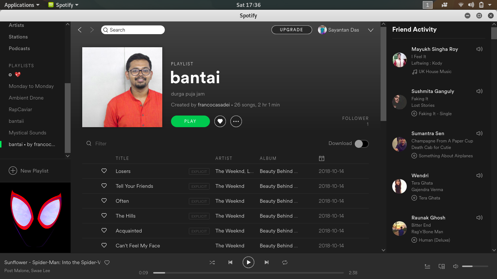
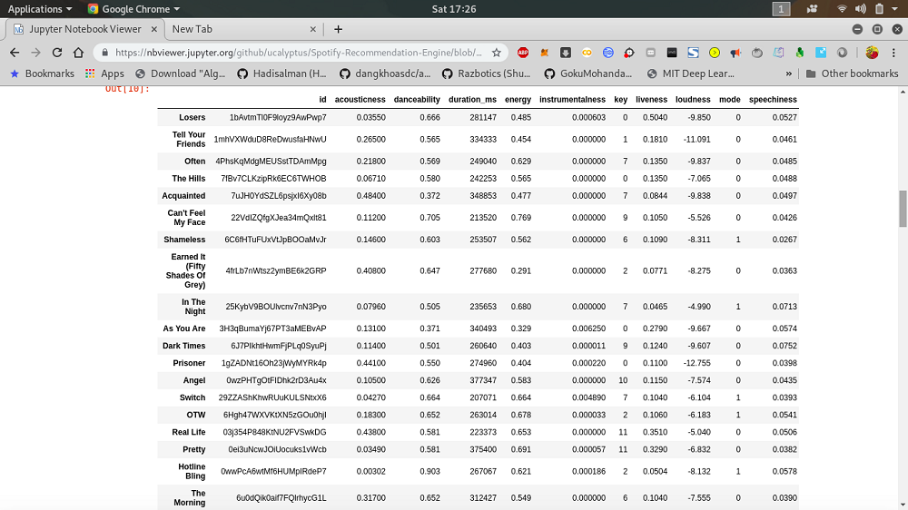

***
## Music recommender system.
## Steps for Layman
### 1.This is my input data

### 2.Spotify has inhouse functions to  extract track details.

### 3.This is the extracted dataframe

### 4.I do Data Analysis and use well known statistical techniques.

## Requirements
* spotipy
```bash
 pip install spotipy
```
## Voila! ,we convert this into a simple data analytics problem.Thanks to this Python wrapper Spotipy


*[Read more about Spotify's recommendation algorithm](Implicit-Matrix-Factorization.md)*

## Statistical techniques Involved:
### 1.Term Frequency Inverse Document Frequency
[Extracting Keywords with TF-IDF and Python’s Scikit-Learn](https://kavita-ganesan.com/extracting-keywords-from-text-tfidf/#.XeUx9ugzbcc) 
[TF-IDF from scratch in python on real world dataset](https://towardsdatascience.com/tf-idf-for-document-ranking-from-scratch-in-python-on-real-world-dataset-796d339a4089)

### 2.Principal Component Analysis
[DeZyre - Principal Component Analysis](https://www.dezyre.com/data-science-in-python-tutorial/principal-component-analysis-tutorial#:~:targetText=Principal%20Component%20Analysis%20Tutorial,-As%20you%20get&targetText=The%20main%20idea%20of%20principal,up%20to%20the%20maximum%20extent.)

### 3.Stratified K Fold Cross Validation
[A Gentle Introduction to k-fold Cross-Validation](https://machinelearningmastery.com/k-fold-cross-validation/) 
[SciKit Learn](https://scikit-learn.org/stable/modules/generated/sklearn.model_selection.StratifiedKFold.html)

### 4.KNN
[Machine Learning Basics with the K-Nearest Neighbors Algorithm](https://towardsdatascience.com/machine-learning-basics-with-the-k-nearest-neighbors-algorithm-6a6e71d01761)

### 5.Decision Tree Classifier
[Understanding Decision Trees for Classification (Python)](https://towardsdatascience.com/understanding-decision-trees-for-classification-python-9663d683c952)

### 6.Random Forest Classifier
[An Implementation and Explanation of the Random Forest in Python](https://towardsdatascience.com/an-implementation-and-explanation-of-the-random-forest-in-python-77bf308a9b76) 

[Spotify Developer](https://beta.developer.spotify.com/documentation/web-api/) for more info  
[Gitter Link](https://gitter.im/Spotify-Recommendation-Engine/community) to join the chat room and contribute

## KWoC contributors
[@sibasmarak](http://github.com/sibasmarak)
